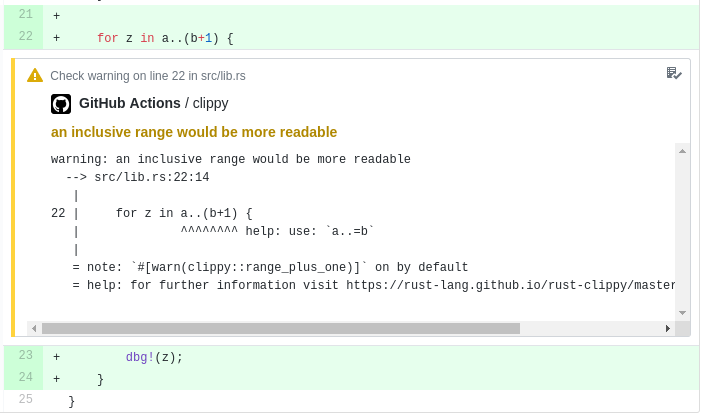

# Rust `clippy-check` Action


[](https://gitter.im/actions-rs/community)

> Clippy lints in your Pull Requests

This GitHub Action executes [`clippy`](https://github.com/rust-lang/rust-clippy)
and posts all lints as annotations for the pushed commit, as in the live example [here](https://github.com/actions-rs/example/pull/2/files).



## Example workflow

This example is utilizing [`components-nightly`](https://github.com/actions-rs/components-nightly)
and [`toolchain`](https://github.com/actions-rs/toolchain) Actions
to install the most recent `nightly` clippy version.

```yaml
on: push
name: Clippy check
jobs:
  clippy_check:
    runs-on: ubuntu-latest
    steps:
      - uses: actions/checkout@v1
      - id: component
        uses: actions-rs/components-nightly@v1
        with:
          component: clippy
      - uses: actions-rs/toolchain@v1
        with:
            toolchain: ${{ steps.component.outputs.toolchain }}
            override: true
      - run: rustup component add clippy
      - uses: actions-rs/clippy-check@v1
        with:
          token: ${{ secrets.GITHUB_TOKEN }}
          args: --all-features
```

### With stable clippy

```yaml
on: push
name: Clippy check
jobs:
  clippy_check:
    runs-on: ubuntu-latest
    steps:
      - uses: actions/checkout@v1
      - run: rustup component add clippy
      - uses: actions-rs/clippy-check@v1
        with:
          token: ${{ secrets.GITHUB_TOKEN }}
          args: --all-features
```

## Inputs

| Name        | Required | Description                                                                                                                            | Type   | Default |
| ------------| :------: | ---------------------------------------------------------------------------------------------------------------------------------------| ------ | --------|
| `token`     | ✓        | GitHub secret token, usually a `${{ secrets.GITHUB_TOKEN }}`                                                                           | string |         |
| `toolchain` |          | Rust toolchain to use; override or system default toolchain will be used if omitted                                                    | string |         |
| `args`      |          | Arguments for the `cargo clippy` command                                                                                               | string |         |
| `use-cross` |          | Use [`cross`](https://github.com/rust-embedded/cross) instead of `cargo`                                                               | bool   | false   |


For extra details about the `toolchain`, `args` and `use-cross` inputs,
see [`cargo` Action](https://github.com/actions-rs/cargo#inputs) documentation.

## Notes

As this Action is using [GitHub Checks API](https://developer.github.com/v3/checks/),
it will not be able to post clippy annotations from the forked repositories
(see [token permissions](https://help.github.com/en/articles/virtual-environments-for-github-actions#token-permissions) table).\
Consider creating workflow file in the original repository instead.
